### Explicació previa

La intenció és, aplicant els coneixements adquirits durant el curs, crear una web de temàtica original i finalitat divulgativa, editable col·laborativament pels usuaris.

### Pluja d'idees:

#### 1- Botiga

Botiga en línia amb catàleg de productes, carret de compra i passarel.la de pagament.

Descartada per la seva complexitat.

#### 2- Terminal de gestió de vols

Terminal de gestió de vols virtual amb registre d'embarcament i base de dades de vols programats.

Descartada per falta d'interès.

#### 3- Cartellera

Cartellera amb informació i tràilers sobre pel·lícules
en cartell i cinemes i horaris on es projecten.

Descartada per la seva senzillesa.

#### 4- Blog notícies

Blog noticies amb portada, seccions informatives i articles.

Descartada per manca d'originalitat.

#### 5- Receptari

Blog cuina amb seccions de receptes, fotografies i ingredients dels plats.

Descartada per la seva simplicitat.

#### 6- Biblioteca

Biblioteca virtual amb base de dades de llibres, catàleg del fons i lector integrat de PDF.

Descartada per desinterès.

#### 7- Enciclopèdia

Enciclopèdia multimèdia en línia amb articles i contingut audiovisual.

Descartada per la seva magnitud.

#### 8- Enquestes

Lloc web d'enquestes via formulari i classificades per seccions.

Descartada per la seva simplicitat.

#### 9- Xarxa social

Xarxa social amb pàgines personals i intercanvi de missatges i fotografies entre usuaris.

Descartada per la seva complexitat.

#### 10- Web valoracions

Lloc web de valoració de productes amb fil de comentaris i sistema de puntuació.

Descartada per la seva elementarietat.

#### 11- Mailing

Client de correu amb enviament de missatges
entre usuaris amb editor integrat i llibreta virtual de contactes.

Descartada per la seva senzillesa.

#### 12- Lloc web de llistes top ten

Lloc web divulgatiu amb llistes 'top-ten' classificades per temàtica editable
col·laborativament pels usuaris.

Escullo aquesta idea per la seva originalitat.

### Nom del projecte:

**Top-ten.**

### Descripció del projecte

Lloc web amb voluntat divulgativa basat en llistes classificatòries tipus 'top-ten'
ordenades per categoria temàtica i editables de forma col·laborativa pels usuaris.

### Descripció de les característiques

El lloc web contindrà llistes classificatòries tipus 'top-ten' com a llistes ordenades
editables via formulari i categoritzades temàticament.

### Viabilitat

El projecte és factible tècnicament i la seva viabilitat és assolible considerant una base d'usuaris editors suficient per
augmentar el contingut del lloc web.

#### Usuaris potencials

Els usuaris potencials del lloc web són qualsevol persona que sàpiga fer servir bàsicament un ordinador, amb inquietud informativa a l'hora de consultar-lo i/o voluntat divulgativa en editar-lo.

#### Mercat a cobrir

El mercat a cobrir pel projecte és el públic general amb coneixement bàsic informàtic com a audiència consultiva i un sector més
reduït com a agents editors amb finalitat divulgativa.

### Documentació técnica

#### Base

El projecte consistirà en cinc pàgines HTML, un full d'estil CSS, 3 fitxers de codi JavaScript i 3 fitxers de codi PHP.

- `index.html` Pàgina principal. Mostra camp i selector de cerca de llista, botó de registre i d'inici de sessió.
- `login.html` Pàgina d'inici de sessió d'usuari editor. Mostra formulari.
- `registrarse.html` Pàgina de registre d'usuari editor. Mostra formulari.
- `editlist.html` Pàgina d'edició de llista. Mostra formulari.
- `searchlist.html` Pàgina de resultat de cerca de llista.

#### Eines

S'utilitzarà:

- **HTML**, **CSS** , **JavaScript**, **Ajax** i **JQuery** per a programar el lloc web.

- **GitHub** per a portar el control de versions.

- La web **freemysqlhosting.net** per a tenir una base de dades **MySQL** externalitzada.

- **Heroku** com a servidor PHP.

- **Composer** per a mantenir les llibreries actualitzades.

- **PHPMailer** per a l'enviament de correu.

- **Recaptcha** de Google per a verificar el registre i l'inici de sessió.

#### Diagrama de Gantt

Enllaçat en un fitxer apart: [gantt.xlsx](./gantt.xlsx)

#### Wireframes

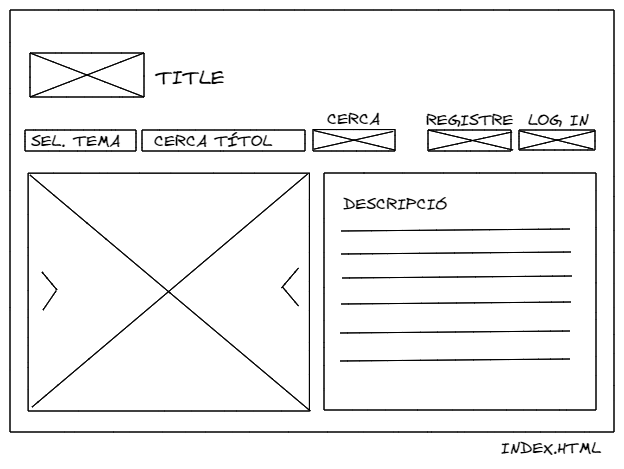
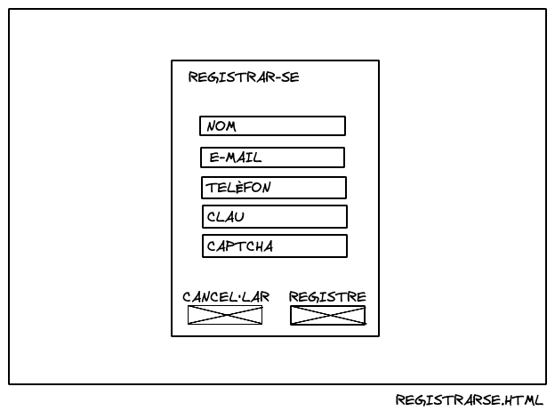
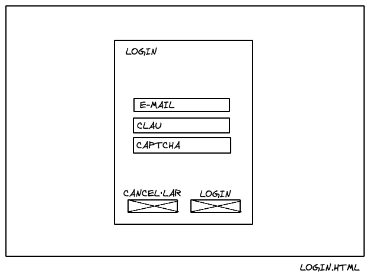
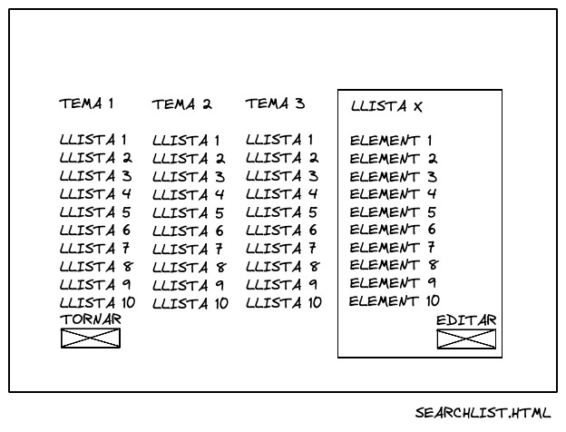
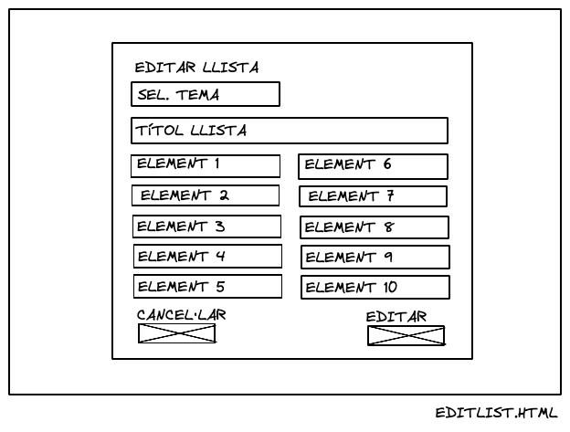

#### Paths

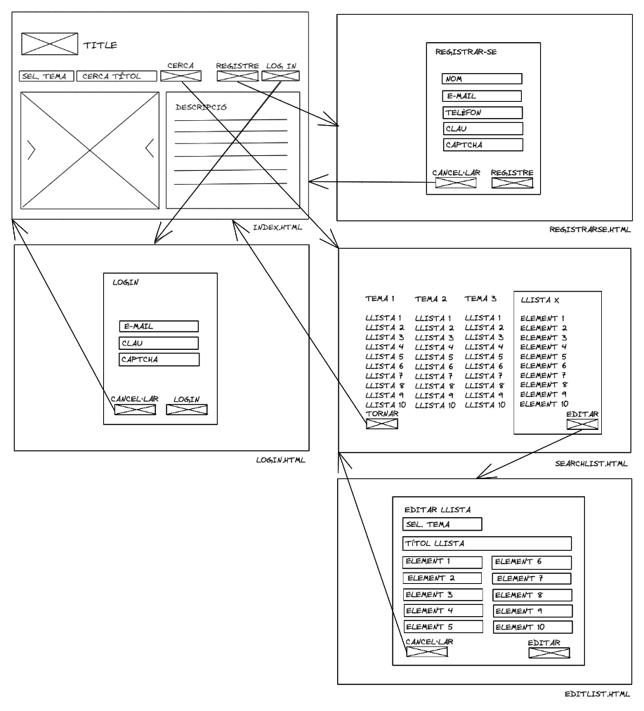

#### Mockups

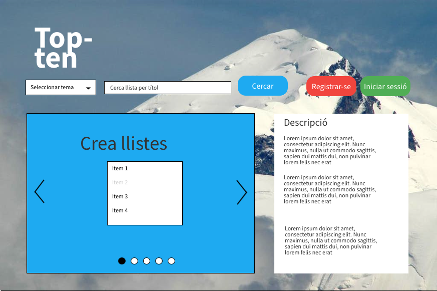
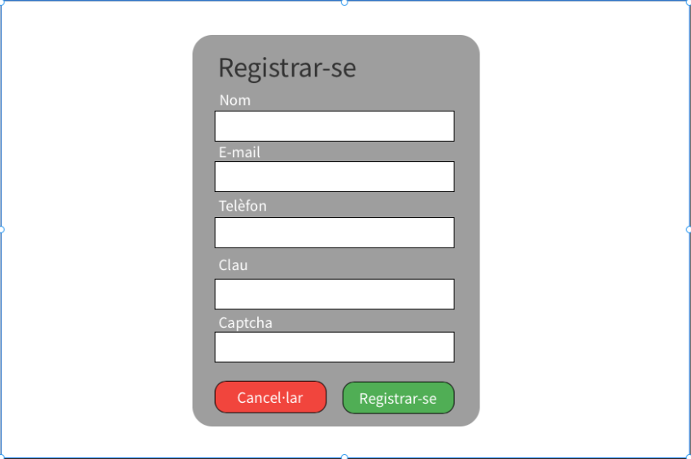
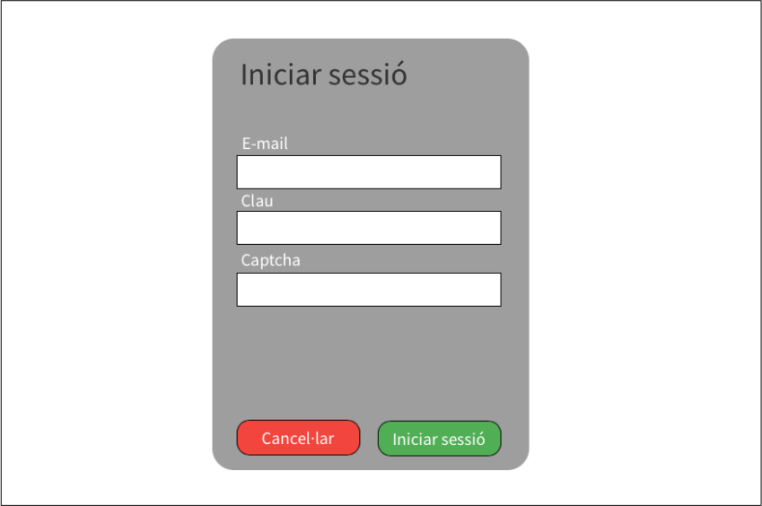
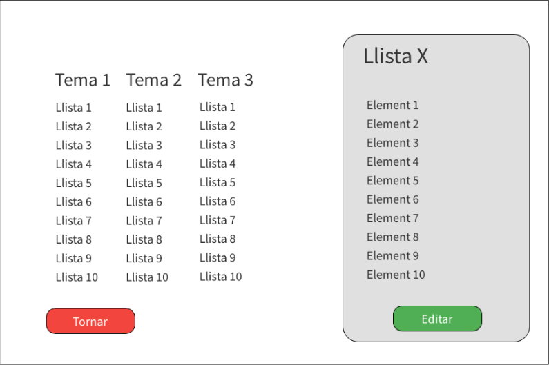
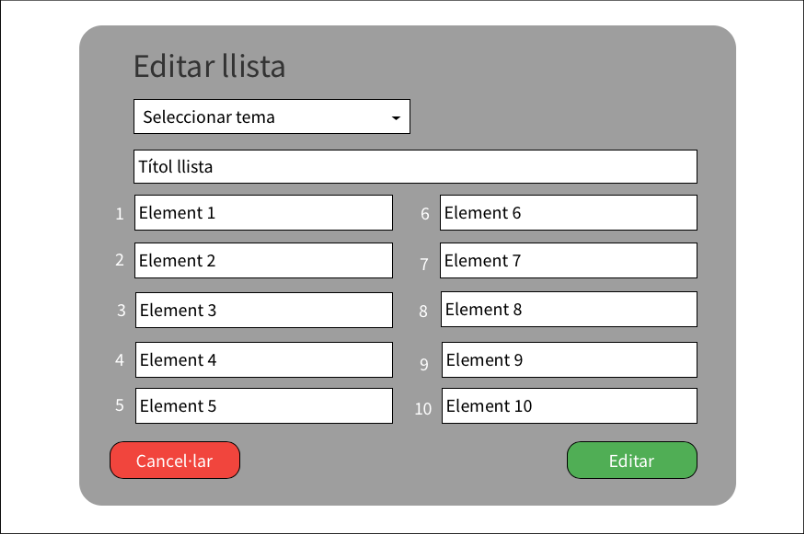

### Casos d'ús

- Registrar usuari.

- Iniciar sessió usuari.

- Crear llista.

- Cercar llista.

- Consultar llista.

- Editar llista.

#### Explicació dels casos d'ús

_Registrar usuari_

L'usuari podrà registrar-se com a editor a una base de dades externa, amb un formulari que requerirà nom, e-mail, telèfon i contrasenya. El registre estarà verificat via 'captcha' i confirmat per correu electrònic.

_Iniciar sessió_

Serà possible l'inici de sessió com a editor registrat contra una base de dades externa, introduint e-mail i contrasenya en un formulari. L'inici de sessió
estarà verificat per 'captcha'.

_Crear llista_

L'usuari registrat i acreditat podrà afegir una llista mitjançant un formulari amb un selector per a la categoria temàtica, un camp de text per al títol i 10 camps de text per a cadascun dels elements que componen la llista.

_Cercar llista_

L'usuari podrà cercar una llista per a consultar o, en cas que estigui acreditat, editar, a través d'un formulari integrat per un selector de temàtica i un camp de text de cerca de títol.

_Consultar llista_

L'usuari podrà consultar una llista fent clic sobre el títol d'aquesta presentat com a resultat d'una cerca.

_Editar llista_

L'usuari registrat i acreditat podrà editar una llista mitjançant un formulari pre-poblat amb un selector per a la categoria temàtica, un camp de text per al títol i 10 camps de text per a cadascun dels elements que componen la llista.
